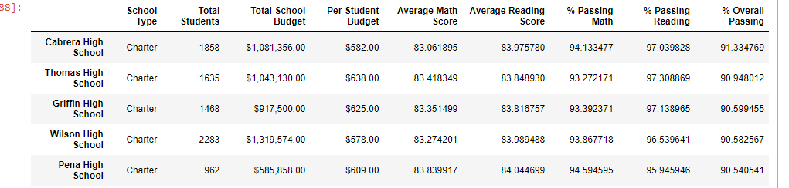
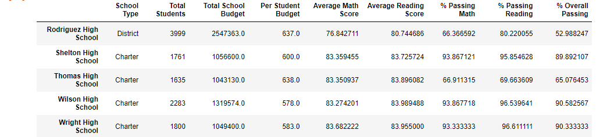
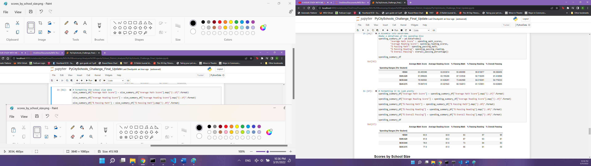
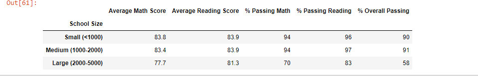
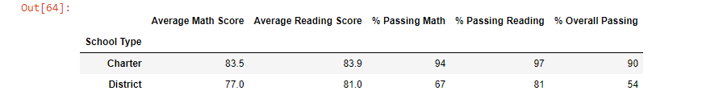

# Overview of the school district analysis
We are analysizing a school district's metrics using Jupter Notebook and Pandas.

## Results

* How is the district summary affected?
* How is the school summary affected?

* Math and reading scores by grade before replace ninth grade scores:
  
* Math and reading scores by grade after replacing ninth grade scores:
  
  * As you can see, Thomas High School's percentage of passing has gone down without the ninth grade class. 
  * The percentage passing math went from 93.3% to 66.9%
  * The percentage passing reading went from 97.3% to 69.6%.
  * The overall passing percentage went from 90.9% to 65.1%.

- The following three images show district scores based on spending, size, and type. 
    - Scores by school spending
     
    - School spending has been split into four ranges. This was determined by calculating the amount each school spends per student and then split into four groups as evenly as possible. 
    - Scores by school size
    
    - Splitting the school size into three groups was determined by the amount of students per school and the number of schools there are. 
    - Scores by school type
    
    - There are two types of schools already categorized for us. 
    
## Summary
Summarize four changes in the updated school district analysis after reading and math scores for the ninth grade at Thomas High School have been replaced with NaNs.
