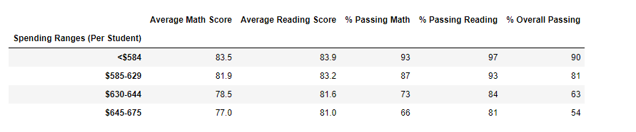

# School District Analysis
## Overview of the school district analysis
We are analysizing a school district's metrics using Jupter Notebook and Pandas.

## Results: Using bulleted lists and images of DataFrames as support, address the following questions.

How is the district summary affected?
How is the school summary affected?
How does replacing the ninth graders’ math and reading scores affect Thomas High School’s performance relative to the other schools?
How does replacing the ninth-grade scores affect the following:
Math and reading scores by grade

- The following three images show district scores based on spending, size, and type. 
    - Scores by school spending
     
    - School spending has been split into four ranges. This was determined by calculating the amount each school spends per student and then split into four groups as evenly as possible. 
    - Scores by school size
    
    - Splitting the school size into three groups was determined by the amount of students per school and the number of schools there are. 
    - Scores by school type
    
    - There are two types of schools already categorized for us. 
    
## Summary
Summarize four changes in the updated school district analysis after reading and math scores for the ninth grade at Thomas High School have been replaced with NaNs.
